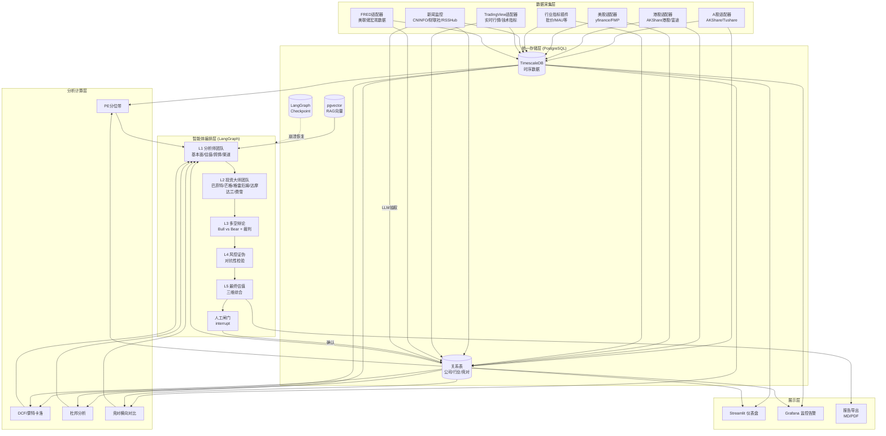
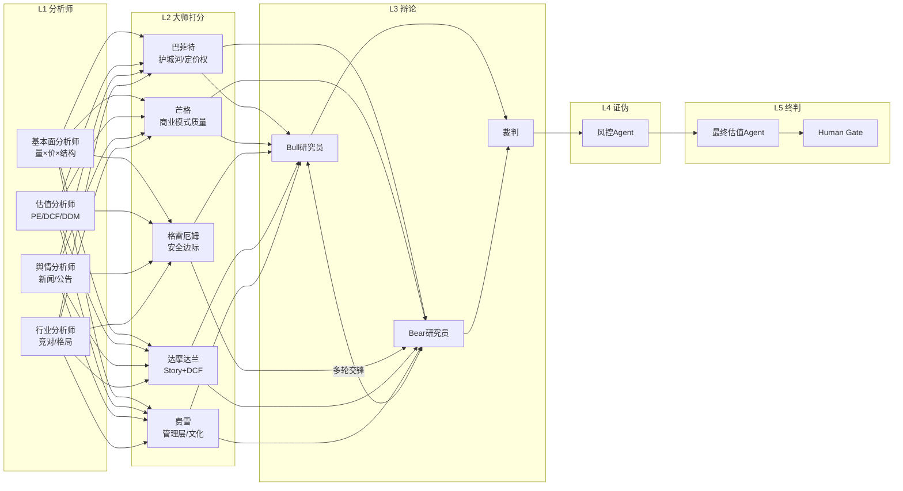

# Design Document: 多行业估值监控与智能体辩证分析系统

## Overview

本系统是一个跨行业、跨市场的投研工具，通过多智能体协作（投资大师打分 + 多空辩论 + 证伪验证）实现自动化估值分析。系统采用分层架构：数据采集层（多市场适配器）→ 分析计算层（估值引擎）→ 智能体编排层（LangGraph 流水线）→ 展示层（Streamlit + Grafana）。核心设计理念是"确定性计算为主、LLM 叙述为辅、对抗性验证为魂"。

## Steering Document Alignment

### Technical Standards (tech.md)

由于项目为新建项目，暂无已有 tech.md。本设计确立以下技术标准：
- **语言**: Python 3.11+
- **包管理**: uv (快速依赖管理)
- **编排框架**: LangGraph 1.x
- **LLM**: 多模型支持（Claude/DeepSeek/Qwen/GPT/Ollama 及任何 OpenAI 兼容 API），通过 LangChain ChatModel 抽象 + LLMRouter 按角色路由，YAML 配置即可接入新模型
- **数据库**: PostgreSQL 16 + TimescaleDB + pgvector 扩展
- **代码风格**: Ruff 格式化 + 类型标注 (Pydantic model 优先)

### Project Structure (structure.md)

```
valuation/
├── src/
│   ├── data/              # 数据采集层
│   │   ├── adapters/      # 市场适配器（A股/港股/美股）
│   │   ├── industry/      # 行业特有指标插件
│   │   └── schemas.py     # 统一数据 schema
│   ├── valuation/         # 估值计算引擎
│   │   ├── dcf.py
│   │   ├── pe_band.py
│   │   ├── monte_carlo.py
│   │   └── dupont.py
│   ├── agents/            # 智能体层
│   │   ├── llm/           # LLM 路由与多模型管理
│   │   ├── masters/       # 投资大师 agent（打分函数+LLM叙述）
│   │   ├── analysts/      # L1 分析师 agent
│   │   ├── debate/        # L3 多空辩论
│   │   ├── risk/          # L4 风控/证伪
│   │   └── final/         # L5 最终估值
│   ├── rag/               # RAG 检索层
│   ├── monitor/           # 新闻监控+告警
│   ├── memory/            # 反思记忆
│   ├── graph/             # LangGraph 流水线编排
│   └── ui/                # Streamlit 仪表盘
├── configs/               # 行业配置/告警规则/大师参数
├── tests/
├── docker-compose.yml     # Postgres + Grafana
└── pyproject.toml
```

## Code Reuse Analysis

### Existing Components to Leverage
- **ai-hedge-fund (MIT)**: 大师 agent 的内部结构（两段式：确定性打分 + LLM 叙述）、统一输出格式 `{signal, confidence, reasoning}`、LangGraph 图拓扑模式
- **muthuspark/multi-agent-debate**: LangGraph + Claude 实现的"两 agent 辩论 + 裁判"模板，直接作为 L3 辩论模块的脚手架
- **TradingAgents**: 多空辩论轮数配置、反思记忆设计模式（不直接引用代码，借鉴架构）
- **financetoolkit**: Ratios/Models 模块计算 DCF 和杜邦分析（喂入自采数据）
- **LlamaIndex**: PDF 摄取/切块/检索的标准管线

### Integration Points
- **AKShare/Tushare/yfinance**: 通过适配器模式统一为 `DataAdapter` 接口
- **TradingView (tradingview-scraper / Tradingview-API)**: 跨市场实时行情、技术指标、市场情绪数据源
- **FRED API**: 美联储经济数据（Fed Funds Rate、Treasury Yields、Gold Price、CPI、Money Supply 等）
- **PostgreSQL (TimescaleDB + pgvector)**: 统一存储时序数据、关系数据、向量数据
- **LangGraph Checkpointer**: 接 PostgreSQL 做持久化 checkpoint
- **Grafana**: 通过 PostgreSQL 数据源配置告警和仪表盘
- **RSSHub**: 新闻/公告的结构化 RSS/JSON 输入

## Architecture

### 系统总体架构



### L1-L5 智能体流水线（单公司估值）



## Components and Interfaces

### Component 1: 数据适配器 (DataAdapter)

- **Purpose:** 将不同市场的数据源统一为标准接口，屏蔽源差异
- **Interfaces:**
  ```python
  class DataAdapter(Protocol):
      def get_financial_statements(self, ticker: str, periods: int) -> FinancialStatements
      def get_price_history(self, ticker: str, start: date, end: date) -> pd.DataFrame
      def get_key_metrics(self, ticker: str) -> dict[str, float]
      def get_macro_indicators(self) -> dict[str, pd.Series]
  
  class AShareAdapter(DataAdapter): ...   # AKShare → Tushare → BaoStock
  class HKAdapter(DataAdapter): ...       # AKShare港股 → 富途
  class USAdapter(DataAdapter): ...       # yfinance → FMP
  class TradingViewAdapter(DataAdapter):  # 跨市场实时行情/技术指标
      def get_realtime_quote(self, symbol: str) -> RealtimeQuote
      def get_technical_indicators(self, symbol: str) -> dict[str, float]
  class FREDAdapter:                      # 美联储宏观经济数据
      def get_series(self, series_id: str, start: date, end: date) -> pd.Series
      def get_macro_indicators(self) -> dict[str, pd.Series]
  ```
- **Dependencies:** AKShare, Tushare, yfinance, httpx, tradingview-scraper, fredapi
- **Reuses:** AKShare 已封装的财报/宏观接口；tradingview-scraper 的 scraper 模块；fredapi 官方 Python 客户端

### Component 2: 行业指标插件 (IndustryPlugin)

- **Purpose:** 为不同行业定义特有指标的采集、计算和告警逻辑
- **Interfaces:**
  ```python
  class IndustryPlugin(Protocol):
      industry: str
      metrics: list[MetricDefinition]
      
      def collect(self, company: Company) -> dict[str, float]
      def get_alert_rules(self) -> list[AlertRule]
      def get_bear_attack_points(self) -> list[str]  # 供看空agent专攻
  
  class BaijiuPlugin(IndustryPlugin): ...      # 批价/合同负债/库存月数
  class InternetPlugin(IndustryPlugin): ...    # MAU/ARPU/获客成本
  class TCMPlugin(IndustryPlugin): ...         # 独家品种占比/集采风险
  class ToyPlugin(IndustryPlugin): ...         # IP生命周期/复购率/盲盒溢价
  ```
- **Dependencies:** DataAdapter, 数据库
- **Reuses:** 无，新建（但参考 ai-hedge-fund 的子函数拆分模式）

### Component 3: 估值引擎 (ValuationEngine)

- **Purpose:** 执行所有确定性估值计算（PE 分位、DCF、蒙特卡洛、杜邦、格雷厄姆数）
- **Interfaces:**
  ```python
  class ValuationEngine:
      def pe_quantile_band(self, ticker: str, years: list[int]) -> PEBandResult
      def dcf(self, ticker: str, assumptions: DCFAssumptions) -> DCFResult
      def monte_carlo_dcf(self, ticker: str, n_simulations: int) -> MonteCarloResult
      def dupont_analysis(self, ticker: str) -> DuPontResult
      def graham_number(self, ticker: str) -> float
      def relative_valuation(self, ticker: str, peers: list[str]) -> RelativeValResult
  ```
- **Dependencies:** pandas, numpy, financetoolkit (Ratios/Models)
- **Reuses:** financetoolkit 的 DCF/杜邦模块（自采数据喂入）

### Component 4: 投资大师 Agent (MasterAgent)

- **Purpose:** 以特定投资大师的哲学对公司进行打分和叙述
- **Interfaces:**
  ```python
  class MasterAgent:
      name: str
      philosophy: str
      
      def score(self, data: CompanyAnalysisData) -> ScoringResult
          """确定性Python打分，不调LLM"""
      
      def narrate(self, score_result: ScoringResult) -> MasterSignal
          """LLM以大师口吻叙述打分结果"""
  
  @dataclass
  class MasterSignal:
      signal: Literal["bullish", "bearish", "neutral"]
      confidence: float  # 0-100
      reasoning: str
  ```
- **Dependencies:** LLM (通过 LLMRouter 统一调用), ValuationEngine, IndustryPlugin, RAG
- **Reuses:** ai-hedge-fund 的两段式范式（打分+叙述分离）

### Component 5: 辩论引擎 (DebateEngine)

- **Purpose:** 编排 Bull/Bear 研究员的多轮辩论及裁判裁决
- **Interfaces:**
  ```python
  class DebateEngine:
      max_rounds: int  # 可配置辩论轮数
      
      def run_debate(
          self,
          bull_evidence: list[Evidence],
          bear_evidence: list[Evidence],
          industry_context: IndustryContext,
          competitor_data: CompetitorComparison
      ) -> DebateResult
  
  @dataclass
  class DebateResult:
      rounds: list[DebateRound]  # 每轮交锋记录
      judge_summary: str
      final_stance: Literal["bullish", "bearish", "neutral"]
      confidence: float
      key_contentions: list[str]
  ```
- **Dependencies:** LLM, LangGraph (循环/条件边), RAG
- **Reuses:** muthuspark/multi-agent-debate 的 LangGraph 辩论模板

### Component 6: 竞争对手分析器 (CompetitorAnalyzer)

- **Purpose:** 自动获取竞对数据并生成横向对比，为辩论提供跨公司论据
- **Interfaces:**
  ```python
  class CompetitorAnalyzer:
      def get_competitors(self, company: Company) -> list[Company]
      def compare_metrics(self, target: str, peers: list[str]) -> ComparisonMatrix
      def industry_landscape(self, industry: str) -> IndustryLandscape
      def relative_position(self, target: str) -> MarketPosition
  ```
- **Dependencies:** DataAdapter, ValuationEngine, 数据库
- **Reuses:** 无，新建

### Component 7: RAG 检索引擎 (RAGEngine)

- **Purpose:** 从研报/年报/公告中检索证据，支撑定性分析
- **Interfaces:**
  ```python
  class RAGEngine:
      def ingest(self, file: Path, company: str, doc_type: str) -> int
          """切块+嵌入+入库，返回chunk数"""
      
      def search(
          self,
          query: str,
          company: str | None = None,
          include_competitors: bool = False,
          top_k: int = 5
      ) -> list[RetrievalResult]
  
  @dataclass
  class RetrievalResult:
      content: str
      source: str       # 文件名
      company: str
      page: int | None
      relevance_score: float
  ```
- **Dependencies:** LlamaIndex, BGE-M3/Qwen3-Embedding, pgvector, bge-reranker
- **Reuses:** LlamaIndex 标准管线 (PDF → 切块 → 嵌入 → 检索)

### Component 8: 新闻监控 Agent (NewsMonitor)

- **Purpose:** 持续监控新闻/公告，抽取关键事件并触发告警
- **Interfaces:**
  ```python
  class NewsMonitor:
      def start_monitoring(self, companies: list[Company]) -> None
      def fetch_news(self, market: Market) -> list[RawNews]
      def classify_event(self, news: RawNews) -> ClassifiedEvent | None
      def check_alerts(self, event: ClassifiedEvent) -> list[Alert]
  ```
- **Dependencies:** RSSHub, AKShare (公告), LLM (分类抽取), Grafana (告警)
- **Reuses:** RSSHub 作为新闻结构化桥

### Component 9: 反思记忆 (ReflectionMemory)

- **Purpose:** 存储历史决策的复盘记录，供后续分析检索
- **Interfaces:**
  ```python
  class ReflectionMemory:
      def record_decision(self, decision: ValuationDecision) -> None
      def generate_reflection(self, decision_id: str, actual_outcome: ActualOutcome) -> Reflection
      def retrieve_relevant(self, company: str, industry: str, context: str) -> list[Reflection]
  ```
- **Dependencies:** pgvector (向量检索), LLM (生成反思)
- **Reuses:** TradingAgents 的反思设计模式

### Component 11: LLM 路由与多模型管理 (LLMRouter)

- **Purpose:** 统一管理多个 LLM 提供商，支持按角色路由、fallback 降级、成本追踪
- **Interfaces:**
  ```python
  class LLMRouter:
      def get_model(self, role: str) -> BaseChatModel
          """根据角色名从配置中查找对应模型，返回 LangChain ChatModel 实例"""
      
      def call(self, role: str, prompt: str, pydantic_model: type[BaseModel] | None = None) -> str | BaseModel
          """统一调用入口：带重试、超时、fallback、结构化输出"""
      
      def get_usage_stats(self) -> UsageStats
          """返回累计 token 消耗、成本估算、各模型调用次数"""

  # 配置结构 (configs/llm.yaml)
  @dataclass
  class ModelConfig:
      provider: str          # "openai" | "anthropic" | "deepseek" | "qwen" | "ollama" | "openai_compatible"
      model_name: str        # e.g. "deepseek-chat", "qwen-max", "claude-sonnet-4-6", "gpt-4o"
      base_url: str | None   # 自定义 endpoint（OpenAI 兼容 API）
      api_key_env: str       # 环境变量名（如 "DEEPSEEK_API_KEY"）
      temperature: float
      max_tokens: int
      cost_per_1k_input: float   # 用于成本估算
      cost_per_1k_output: float

  @dataclass
  class LLMConfig:
      default_model: str                    # 默认模型引用名
      models: dict[str, ModelConfig]        # 模型注册表 {"claude-main": ModelConfig, "deepseek-cheap": ...}
      role_routing: dict[str, str]          # 角色→模型映射 {"master_narrate": "deepseek-cheap", "debate": "claude-main", ...}
      fallback_chain: list[str]             # 降级顺序 ["claude-main", "deepseek-cheap", "qwen-local", "ollama-local"]
  ```
- **Dependencies:** langchain-core (BaseChatModel), langchain-openai, langchain-anthropic, langchain-community (Ollama)
- **Reuses:** LangChain 的 ChatModel 抽象层统一所有提供商接口；ai-hedge-fund 已有的多 provider 支持模式

### Component 12: LangGraph 流水线编排 (ValuationGraph)

- **Purpose:** 将所有组件编排为有状态、可暂停、可恢复的估值流水线
- **Interfaces:**
  ```python
  class ValuationGraph:
      def build_graph(self) -> CompiledStateGraph
      def run(self, company: str, config: RunConfig) -> ValuationReport
      def resume(self, thread_id: str, user_feedback: str) -> ValuationReport
  
  # State Schema
  class ValuationState(TypedDict):
      company: str
      industry: str
      competitors: list[str]
      financial_data: FinancialStatements
      industry_metrics: dict
      competitor_comparison: ComparisonMatrix
      analyst_reports: list[AnalystReport]
      master_signals: list[MasterSignal]
      debate_result: DebateResult
      risk_assessment: RiskAssessment
      final_report: ValuationReport | None
      human_approved: bool
  ```
- **Dependencies:** LangGraph, PostgreSQL (checkpointer), 所有其他组件
- **Reuses:** ai-hedge-fund 的图拓扑模式 + LangGraph interrupt() 机制

## Data Models

### Company (公司)
```
- id: UUID
- ticker: str              # 股票代码 (600519.SH / 9992.HK / GOOGL)
- name: str                # 公司名称
- market: enum             # A_SHARE | HK | US
- industry: str            # 行业标签
- competitors: list[str]   # 竞争对手 ticker 列表
- custom_groups: list[str] # 用户自定义分组
- is_active: bool          # 是否活跃追踪
- created_at: datetime
```

### FinancialStatements (财报三表)
```
- id: UUID
- ticker: str
- period: date             # 报告期
- market: enum
- revenue: Decimal         # 营收
- net_profit: Decimal      # 净利润
- gross_margin: float      # 毛利率
- roe: float               # ROE
- contract_liabilities: Decimal | None  # 合同负债（A股）
- total_assets: Decimal
- total_liabilities: Decimal
- operating_cashflow: Decimal
- eps: Decimal
- bvps: Decimal
- raw_data: JSONB          # 完整原始数据
- fetched_at: timestamp
```

### IndustryMetric (行业特有指标时序)
```
- ticker: str
- metric_name: str         # 如 "batch_price_maotai_feitian"
- metric_value: float
- recorded_at: timestamp   # TimescaleDB hypertable 分区键
- source: str              # 数据来源
- confidence: float        # 数据置信度 (手动=1.0, OCR=0.7-0.9)
```

### MasterSignalRecord (大师打分记录)
```
- id: UUID
- ticker: str
- master_name: str         # "buffett" | "graham" | "damodaran" | ...
- signal: enum             # BULLISH | BEARISH | NEUTRAL
- confidence: float
- reasoning: str
- scoring_details: JSONB   # 各子函数得分明细
- created_at: timestamp
```

### DebateRecord (辩论记录)
```
- id: UUID
- ticker: str
- rounds: JSONB            # [{round: 1, bull_argument: ..., bear_argument: ...}, ...]
- judge_summary: str
- final_stance: enum
- confidence: float
- key_contentions: list[str]
- competitor_evidence_used: list[str]
- created_at: timestamp
```

### ValuationReport (估值报告)
```
- id: UUID
- ticker: str
- valuation_low: Decimal   # 低情景
- valuation_mid: Decimal   # 中情景
- valuation_high: Decimal  # 高情景
- pe_quantile: float       # 当前PE所处分位
- bull_arguments: list[str]
- bear_arguments: list[str]
- key_assumptions: list[str]
- sensitivity_factors: JSONB
- competitor_comparison: JSONB
- human_approved: bool
- approved_at: timestamp | None
- created_at: timestamp
```

### Reflection (反思记录)
```
- id: UUID
- decision_id: UUID        # 关联的估值报告
- ticker: str
- industry: str
- predicted_signal: enum
- actual_outcome: str
- correct_arguments: list[str]
- failed_arguments: list[str]
- lesson_learned: str
- embedding: vector(1024)  # 用于语义检索
- created_at: timestamp
```

## Error Handling

### Error Scenarios

1. **数据源不可用**
   - **Handling:** 三级回退链（A 股: AKShare → Tushare → BaoStock；美股: yfinance → FMP）。每次回退记录日志，连续 3 次全部失败则触发断流告警
   - **User Impact:** 仪表盘显示数据时效标记（"数据截止于 XX"），不影响已有数据的分析

2. **LLM 调用失败/超时**
   - **Handling:** 重试 3 次（指数退避），仍失败则该 agent 返回 `{signal: "neutral", confidence: 0, reasoning: "LLM unavailable"}`，不阻塞流水线
   - **User Impact:** 大师卡片显示"暂时不可用"，其余大师结论正常展示

3. **LangGraph 流水线崩溃**
   - **Handling:** 通过 PostgreSQL checkpointer 自动保存每个节点执行后的状态。崩溃后从最后成功 checkpoint 恢复，不从头重跑
   - **User Impact:** 短暂中断后自动恢复，用户可通过 thread_id 查看进度

4. **RAG 检索无相关结果**
   - **Handling:** 返回 `relevance_score < threshold` 的标记，agent 收到后在 reasoning 中声明"证据不足，基于财务数据推断"
   - **User Impact:** 报告中标注"此论点缺乏文档证据支撑"

5. **行业指标录入数据异常**
   - **Handling:** 设置合理性校验（如批价 ∈ [500, 5000] 元/瓶），超出范围要求确认
   - **User Impact:** 弹出确认提示"该数值超出历史范围，确认录入？"

6. **竞争对手数据缺失**
   - **Handling:** 横向对比中标注"数据缺失"，不影响目标公司自身分析
   - **User Impact:** 对比表中相应单元格显示 N/A

## Testing Strategy

### Unit Testing
- **估值引擎**: 用已知财务数据验证 DCF/PE分位/杜邦计算正确性
- **大师打分函数**: 用预设的财务数据集验证各大师的打分阈值逻辑（不涉及 LLM）
- **数据适配器**: Mock 外部 API 响应，验证 schema 转换正确性
- **行业插件**: 验证指标计算和告警规则触发逻辑

### Integration Testing
- **数据采集 → 存储**: 验证从真实 API 到 TimescaleDB 的完整数据流
- **RAG 管线**: PDF 摄取 → 切块 → 嵌入 → 检索 → 验证相关性
- **LangGraph 流水线**: 单公司完整 L1-L5 流水线跑通，验证状态传递和 checkpoint
- **回退链**: 模拟主源故障，验证自动切换至备用源

### End-to-End Testing
- **完整估值场景**: 对茅台运行完整流水线（数据采集 → 大师打分 → 辩论 → 人工确认），验证输出完整性
- **跨市场场景**: 对谷歌（美股）运行流水线，验证美股适配器和英文 LLM 叙述正确性
- **告警场景**: 注入"营收↑+合同负债↓+批价↓"测试数据，验证压货预警触发
- **竞对对比**: 同时分析茅台与五粮液，验证横向对比数据生成
